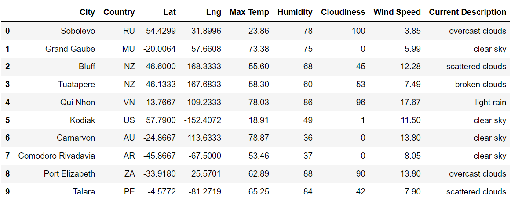
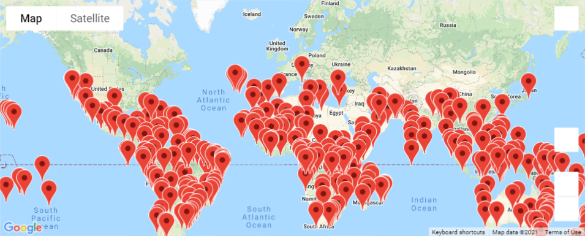
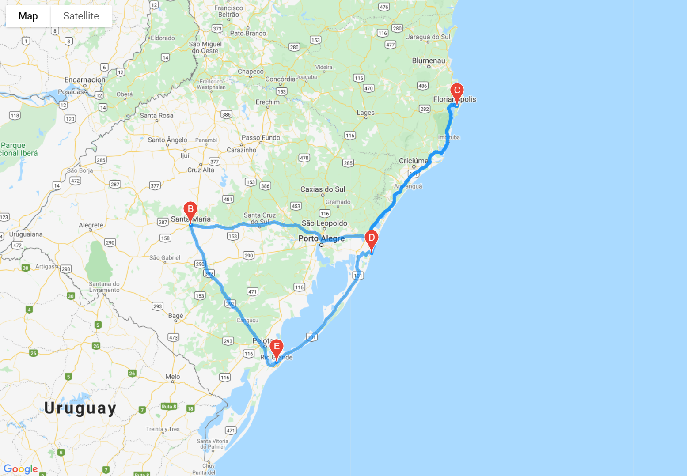
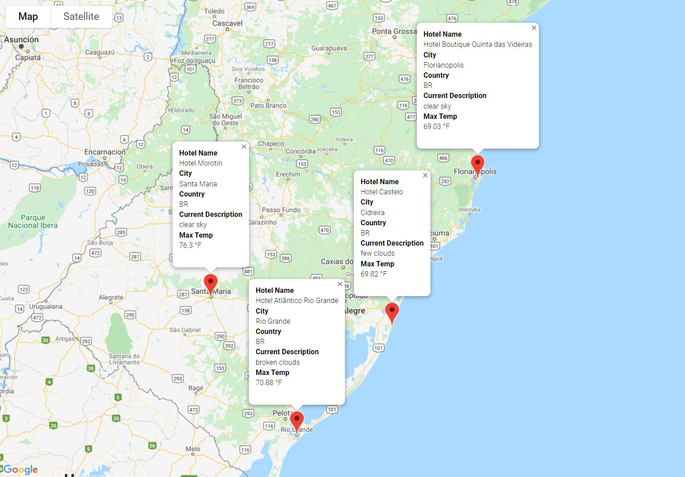

# World_Weather_Analysis

## Overview

The PlanMyTrip app creates travel itineraries based on users' weather preferences using APIs from Google and OpenWeatherMap.

## Development Environment

* Python 3.7.10
  * Pandas library
  * Matplotlib library
  * Numpy
  * Citipy
* Anaconda 4.10.3
* Jupyter Notebook 6.1.4
* OpenWeatherMaps
* Gmaps

## Deliverable 1: Retrieve Weather Data

## Deliverable 2: Create a Customer Travel Destinations Map

## Deliverable 3: Create a Travel Itinerary Map

